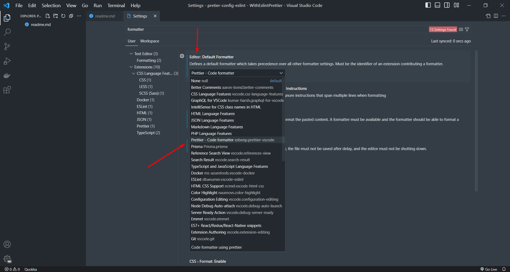

## [quick install/setup (node js)](https://github.com/milon27/eslint-prettier-node-ts/blob/master/nodejs-setup)
## [quick install/setup (react js)](https://github.com/milon27/eslint-prettier-node-ts/blob/master/react-js-setup.md)


## details setup

1. follow this guide/video:
    - https://www.youtube.com/watch?v=kWIlrSorqFE&ab_channel=FutureWebDesign
    - https://youtu.be/cchqeWY0Nak?t=516
    - https://gist.github.com/bradtraversy/aab26d1e8983d9f8d79be1a9ca894ab4
1. install prettier extension in vscode and setup as default formatter
   
1. create node project `npm init -y`
1. `pnpm i -D eslint` (use exact version)
1. `npx eslint --init` [it will install few deps]
1. `pnpx install-peerdeps --dev eslint-config-airbnb-base` [ for react: eslint-config-airbnb ]
    - for node `pnpm install eslint-config-airbnb-base@15.0.0 eslint@^8.2.0 eslint-plugin-import@^2.25.2 --save-dev`
    - for react: `pnpm install eslint-config-airbnb@19.0.4 eslint@^8.2.0 eslint-plugin-import@^2.25.3 eslint-plugin-jsx-a11y@^6.5.1 eslint-plugin-react@^7.28.0 eslint-plugin-react-hooks@^4.3.0 --save-dev`
1. make the extends array like this: `extends: ["airbnb-base", "plugin:@typescript-eslint/recommended"],` or for react `extends: ["airbnb", "plugin:react/recommended","plugin:@typescript-eslint/recommended"]`
1. we need another plugin for typescript : eslint-config-airbnb-typescript `pnpm i -D eslint-config-airbnb-typescript`
1. update it extends: `extends: ["airbnb-base", "airbnb-typescript/base", "plugin:@typescript-eslint/recommended",]`
    - for react `extends: ["airbnb", "airbnb-typescript", "plugin:react/recommended", "plugin:@typescript-eslint/recommended",]`
    - add parser option

```json
    parserOptions: {
       ecmaVersion: "latest",
       sourceType: "module",
    +  project: "./tsconfig.json",
    },
```

    - tell tsconfig.json about eslint

```json
"include": [".eslintrc.js", "src"]
```

## setup prettier

1. install deps: `pnpm i -D prettier eslint-config-prettier eslint-plugin-prettier`
1. add .prettierrc.js

```js
// prettier.config.js or .prettierrc.js or .prettierrc.cjs
module.exports = {
    trailingComma: 'es5',
    tabWidth: 4,
    semi: false,
    singleQuote: true,
}

// if you change any rule then reload the window
```

1. update extends in eslint config

```js
extends: [
    ...,
   'airbnb-base',
   'airbnb-typescript/base',
   'plugin:@typescript-eslint/recommended',
   'plugin:prettier/recommended',
],
```

1. update plugin

```js
plugins: ['@typescript-eslint', 'prettier'],
```

1. disable few rule in eslint

```js
rules: {
        'prettier/prettier': [
            'warn',
            {
                endOfLine: 'auto',
            },
        ],
        'no-console': 'off',
        'linebreak-style': 'off',
    }
```

1. add script for eslint
```json
"lint": "npx eslint . --fix",
"lint:check": "npx eslint ."
```
